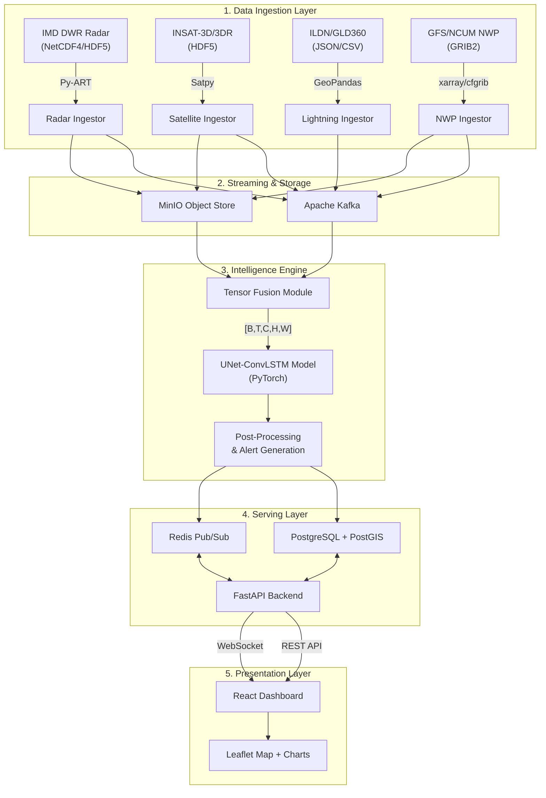

# SIH 2026 — Problem Statement 26072
# StormSight: AI/ML-Based Nowcasting of Thunderstorm & Lightning

> **Team Name:** Team StormSight  
> **Problem Statement ID:** PS26072  
> **Theme:** Disaster Management  
> **Category:** Software  
> **Organization:** Ministry of Earth Sciences (MoES) / India Meteorological Department (IMD)

---

## SLIDE 1 — Title Slide

### STORMSIGHT
**AI-Powered Thunderstorm & Lightning Nowcasting Platform**

| Field | Details |
|---|---|
| **Problem Statement** | PS26072: AIML-based Nowcasting of thunderstorm and lightning using atmospheric observation including multiple radars, satellite, lightning and model data |
| **Ministry** | Ministry of Earth Sciences (MoES) |
| **Department** | India Meteorological Department (IMD) |
| **Team Size** | 6 Members |
| **Category** | Software |
| **Theme** | Disaster Management |

---

## SLIDE 2 — Problem Statement & Understanding

### The Problem
Every year, India faces **2,500+ deaths due to lightning and thunderstorms** — making it the deadliest natural hazard in the country. Current NWP (Numerical Weather Prediction) models take **6+ hours** to compute and operate at resolutions too coarse for localized warnings. Real-time atmospheric observations from **multiple radars, satellites, lightning detection networks, and NWP model outputs** remain fragmented across separate systems with no unified AI-driven pipeline.

### Key Challenges Identified
1. **Data Fragmentation**: Radar (IMD DWR), Satellite (INSAT-3D/3DR), Lightning (ILDN/GLD360), and NWP (GFS/NCUM) data exist in siloed systems with different formats, projections, and temporal resolutions
2. **Rapid Storm Evolution**: Thunderstorms initiate, intensify, and dissipate within **30–90 minutes** — far faster than traditional NWP update cycles
3. **Spatial Resolution Gap**: NWP models operate at 13–25 km grids while thunderstorms are **mesoscale events** requiring 1–5 km resolution
4. **Latency Requirements**: End-to-end pipeline must deliver predictions within **90 seconds** of sensor data arrival
5. **Multi-Modal Fusion**: No existing system fuses all 4 observation types into a unified deep learning tensor

### What IMD/MoES Needs
- **0–120 minute** lead time predictions
- **2 km spatial resolution** grids
- **Probability maps** for thunderstorm occurrence and lightning strike density
- **Automated alert generation** with severity classification
- **Real-time dashboard** for operational meteorologists

---

## SLIDE 3 — Proposed Solution (Idea Title)

### StormSight: Multi-Modal Spatio-Temporal AI Nowcasting Engine

```
┌─────────────────────────────────────────────────────────┐
│                    DATA INGESTION                       │
│  [ Radar ] + [ Satellite ] + [ Lightning ] + [ NWP ]   │
│       ↓            ↓             ↓            ↓        │
│  ┌────────────────────────────────────────────────┐     │
│  │     TENSOR FUSION MODULE (Common CRS Grid)     │     │
│  │     [B, T=4, C=7, H=512, W=512] Tensor        │     │
│  └────────────────────┬───────────────────────────┘     │
│                       ↓                                 │
│  ┌────────────────────────────────────────────────┐     │
│  │     UNet-ConvLSTM DEEP LEARNING MODEL          │     │
│  │     (Spatial + Temporal Feature Learning)       │     │
│  └────────────────────┬───────────────────────────┘     │
│                       ↓                                 │
│  ┌────────────────────────────────────────────────┐     │
│  │     POST-PROCESSING & ALERT GENERATION         │     │
│  │     → Probability Maps (8 future time steps)    │     │
│  │     → Severity Classification (6 risk levels)   │     │
│  │     → Automated Alert Polygons                  │     │
│  └────────────────────┬───────────────────────────┘     │
│                       ↓                                 │
│  ┌────────────────────────────────────────────────┐     │
│  │     STORMSIGHT DASHBOARD (React + Leaflet)      │     │
│  │     → Real-time Map Visualization               │     │
│  │     → Active Alerts Panel                       │     │
│  │     → Forecast Timeline (0 to +120 min)         │     │
│  └────────────────────────────────────────────────┘     │
└─────────────────────────────────────────────────────────┘
```

### Three Core Innovations
1. **Multi-Source Tensor Fusion**: First system to fuse Radar + Satellite + Lightning + NWP into a single [B, T, C, H, W] tensor for deep learning inference
2. **UNet-ConvLSTM Architecture**: Spatial encoder-decoder (UNet) combined with temporal sequence modeling (ConvLSTM) for physics-aware storm evolution prediction
3. **Sub-90-Second Latency Pipeline**: Kafka-based streaming architecture ensures predictions reach the dashboard within 90 seconds of raw sensor data arrival

---

## SLIDE 4 — Technical Approach / Methodology

### End-to-End Pipeline Architecture



### Methodology Steps

| Phase | Activity | Tools / Libraries |
|---|---|---|
| **Phase 1: Data Ingestion** | Ingest radar reflectivity (CAPPI), satellite brightness temperature, lightning point data, NWP grids | Py-ART, Satpy, GeoPandas, xarray, cfgrib |
| **Phase 2: Preprocessing** | Reproject to common UTM CRS, spatial alignment to 512×512 grid at 2km resolution, temporal synchronization to 15-min intervals | rasterio, pyproj, scipy |
| **Phase 3: Tensor Fusion** | Stack 7 channels (Radar Z, TIR1, WV, BTD, Lightning KDE, CAPE, CIN) across 4 historical timesteps | NumPy, PyTorch |
| **Phase 4: Model Training** | Train UNet-ConvLSTM on historical monsoon season data using custom composite loss (Weighted MSE + SSIM + Soft-CSI) | PyTorch, torchvision |
| **Phase 5: Inference** | Real-time inference producing 8 future timesteps (up to +120 min) of reflectivity + lightning probability | PyTorch, CUDA |
| **Phase 6: Post-Processing** | Threshold probability maps → severity classification → polygon alert generation | Shapely, GeoAlchemy2, PostGIS |
| **Phase 7: Visualization** | Real-time dashboard with map overlays, alert panels, forecast timeline | React, Leaflet, Zustand |

---

## SLIDE 5 — Machine Learning Architecture

### Model: UNet-ConvLSTM Hybrid

**Input Tensor**: `[B, T_in=4, C=7, H=512, W=512]`

| Channel | Source | Description |
|---|---|---|
| C₀ | Radar | Reflectivity (Z_H) normalized [0,1] where 1.0 = 70 dBZ |
| C₁ | Satellite | TIR1 Brightness Temperature (Kelvin → [0,1]) |
| C₂ | Satellite | Water Vapor (WV) channel |
| C₃ | Derived | Brightness Temperature Difference (TIR1 − WV) |
| C₄ | Lightning | Gaussian KDE density heatmap from sparse point strikes |
| C₅ | NWP | CAPE (Convective Available Potential Energy) |
| C₆ | NWP | CIN (Convective Inhibition) |

**Output Tensor**: `[B, T_out=8, C_out=2, H=512, W=512]`
- C₀_out: Predicted Radar Reflectivity (0–120 min)
- C₁_out: Predicted Lightning Strike Probability (0–120 min)

### Loss Function
```
L_total = α · L_WB-MSE + β · (1 − SSIM) + γ · L_Soft-CSI
```
- **L_WB-MSE**: Weighted Balanced MSE — exponentially weights pixels where true Z ≥ 35 dBZ (severe storm threshold)
- **SSIM**: Structural Similarity Index — preserves spatial structure and prevents blurring
- **L_Soft-CSI**: Differentiable approximation of Critical Success Index — directly optimizes the meteorological verification metric

### Target Performance Metrics
| Metric | Target | Description |
|---|---|---|
| **CSI (Critical Success Index)** | ≥ 0.55 | For ≥ 35 dBZ reflectivity threshold |
| **POD (Probability of Detection)** | ≥ 0.70 | Minimize missed severe storms |
| **FAR (False Alarm Ratio)** | ≤ 0.35 | Minimize false warnings |
| **Lead Time** | 0–120 min | 8 prediction intervals at 15 min each |
| **Spatial Resolution** | 2 km | 512×512 grid covering 1024×1024 km |
| **Inference Latency** | < 3 sec | GPU inference on single batch |

---

## SLIDE 6 — System Architecture & Tech Stack

### Technology Stack

| Layer | Technology | Purpose |
|---|---|---|
| **Frontend** | React 19 + TypeScript + Vite | Single Page Application |
| **Map Engine** | Leaflet (react-leaflet) | Geospatial visualization |
| **State Management** | Zustand | Lightweight reactive store |
| **Styling** | Tailwind CSS 4 | Utility-first responsive design |
| **Backend API** | FastAPI (Python 3.11) | Async REST + WebSocket server |
| **Database** | PostgreSQL 17 + PostGIS | Spatial queries, alert storage |
| **Cache/PubSub** | Redis | Real-time event distribution |
| **Message Broker** | Apache Kafka | Streaming sensor data pipeline |
| **Object Storage** | MinIO (S3-compatible) | Binary blobs (radar/satellite files) |
| **ML Framework** | PyTorch 2.14 + CUDA | Model training and inference |
| **Data Processing** | Py-ART, Satpy, xarray, rasterio | Sensor-specific ETL |
| **ORM/Migrations** | SQLAlchemy 2.1 + Alembic | Database schema management |
| **Containerization** | Docker + Docker Compose | Reproducible deployments |

### Database Schema (PostGIS)

| Table | Purpose | Key Columns |
|---|---|---|
| `nowcasts` | Thunderstorm predictions | run_time, lead_time, affected_area (POLYGON), probability, intensity_class |
| `alerts` | Severity-classified warnings | nowcast_id (FK), alert_type, severity, alert_area (POLYGON), valid_until |
| `lightning_events` | Individual lightning strikes | event_time, location (POINT), current_ka, polarity |
| `radar_scans` | Radar scan metadata | station_id, scan_time, file_path, bbox (POLYGON) |
| `satellite_frames` | Satellite frame metadata | satellite_name, channel, scan_time, bbox (POLYGON) |
| `nwp_runs` | NWP model run metadata | model_name, run_time, file_path |

---

## SLIDE 7 — Dashboard & User Interface

### Dashboard Features

1. **Real-Time Map Visualization**
   - Interactive Leaflet map centered on India
   - Alert zone overlays with 6-tier risk color coding (Minimal → Extreme)
   - Location search with autocomplete (700+ Indian cities/districts)
   - Region filtering (All India, North, South, East, West, Central, NE)
   - Custom zoom controls with fullscreen mode

2. **Statistics Cards (Top Panel)**
   - Active Thunderstorm Cells (live count from DB)
   - Lightning Events (last 30 minutes)
   - High Risk Areas (severe + extreme alerts)
   - Coverage Area (active monitoring region)

3. **Active Warnings Panel (Side Panel)**
   - Sorted by severity (Extreme → Minimal)
   - Each alert shows: risk level badge, title, description, probability %, time remaining
   - Color-coded borders matching the risk classification

4. **Forecast Timeline View**
   - 6-panel grid showing predicted evolution at: Now, +15, +30, +60, +90, +120 minutes
   - Playback controls with speed adjustment
   - Toggle between Thunderstorm / Lightning / Both views

5. **Additional Views (Sidebar Navigation)**
   - Dashboard (main view)
   - Nowcast Map (dedicated full-screen map)
   - Observations (raw sensor data)
   - Forecast Timeline (multi-panel evolution)
   - Alerts (dedicated alert management)
   - Analytics (historical performance metrics)
   - Historical Replay (past event analysis)
   - Settings (configuration)

---

## SLIDE 8 — Data Sources & Integration

### Multi-Source Data Fusion Matrix

| Source | Provider | Native Format | Cadence | Resolution | Processing Library | Normalized Output |
|---|---|---|---|---|---|---|
| **Doppler Weather Radar** | IMD DWR Network | NetCDF4 / HDF5 | 10 min | ~1–2 km (radial) | `arm-pyart`, `wradlib` | CAPPI Cartesian Grid (dBZ) |
| **Geostationary Satellite** | MOSDAC (INSAT-3D/3DR) | HDF5 | 15–30 min | 4 km (IR) | `satpy`, `pyresample` | TIR1, TIR2, WV (Kelvin → [0,1]) |
| **Lightning Detection** | ILDN / GLD360 | JSON / CSV (Points) | Continuous | Point Coordinates | `geopandas`, `scipy` | 2D Gaussian KDE Heatmap |
| **Numerical Weather Prediction** | GFS / NCUM | GRIB2 | 6-hourly | ~13–25 km | `xarray`, `cfgrib` | CAPE, CIN, Bulk Shear Grids |

### Kafka Streaming Topics
- `ingest.radar.raw` — Partitioned by `radar_station`
- `ingest.satellite.insat` — Partitioned by `channel`
- `ingest.lightning.strikes` — Partitioned by spatial geohash
- `inference.nowcast.completed` — Consumed by Backend API for WebSocket push

---

## SLIDE 9 — API Specifications

### RESTful Endpoints (FastAPI)

| Method | Endpoint | Description |
|---|---|---|
| `GET` | `/health` | Health check + system status |
| `GET` | `/nowcast` | Latest 10 thunderstorm nowcasts |
| `GET` | `/nowcast/{id}` | Specific nowcast details |
| `POST` | `/nowcast/trigger` | Manually trigger inference cycle |
| `GET` | `/alerts` | All active alerts (valid_until > now) |
| `GET` | `/alerts/{id}` | Specific alert with nowcast relation |
| `GET` | `/radar/latest` | Latest radar scan per station |
| `GET` | `/radar/station/{id}` | Recent scans for specific DWR station |
| `GET` | `/lightning/recent?minutes=30` | Recent lightning strokes (last N minutes) |
| `GET` | `/lightning/density` | Lightning density grid for bounding box |
| `POST` | `/ingest/radar` | Ingest new radar scan metadata |
| `POST` | `/ingest/lightning` | Ingest new lightning event batch |

### WebSocket Protocol (`/ws/live-stream`)
- Client heartbeat: `{"type": "ping"}` every 30s
- Server push events: `NEW_ALERT`, `NOWCAST_FRAME_READY`
- Payload format: JSON with GeoJSON geometries

---

## SLIDE 10 — Feasibility & Viability

### Technical Feasibility
- ✅ **All data sources exist**: IMD DWR network (35+ radars), INSAT-3D/3DR (continuous), ILDN (operational), GFS (public)
- ✅ **Proven architecture patterns**: Similar to European STEPS/pySTEPS and US MRMS systems
- ✅ **Open-source ML stack**: PyTorch, Py-ART, Satpy — no vendor lock-in
- ✅ **Scalable infrastructure**: Docker Compose for dev, Kubernetes-ready for production

### Commercial Viability
- **Primary Users**: IMD forecasters, NDMA (National Disaster Management Authority), State DMAs
- **Secondary Users**: Aviation (DGCA/AAI), Defense (IAF), Agriculture (crop insurance), Infrastructure (power grid operators)
- **Revenue Model**: Government contract (B2G) with potential B2B licensing for aviation weather services
- **Cost Efficiency**: Replaces expensive proprietary systems with open-source AI-driven platform

### Impact Assessment
| Metric | Current State | With StormSight |
|---|---|---|
| Warning Lead Time | 30–60 min (NWP-based) | **15–120 min** (AI nowcasting) |
| Spatial Precision | 25 km grids | **2 km grids** |
| Update Frequency | 6-hourly | **Every 10–15 minutes** |
| End-to-End Latency | 30+ minutes | **< 90 seconds** |
| Lives Saved (est.) | — | **500–1000/year** (with effective dissemination) |

---

## SLIDE 11 — Implementation Timeline

### 36-Hour Hackathon Plan

| Hour | Phase | Deliverable |
|---|---|---|
| 0–4 | Infrastructure Setup | Docker Compose, PostgreSQL+PostGIS, FastAPI skeleton, React scaffold |
| 4–8 | Data Pipeline | Kafka topics, ingestor daemons for radar/satellite/lightning |
| 8–14 | ML Model | UNet-ConvLSTM architecture, tensor fusion module, training loop |
| 14–18 | Backend API | REST endpoints, WebSocket, database migrations, seed data |
| 18–24 | Frontend Dashboard | Map visualization, alert panels, stats cards, forecast timeline |
| 24–30 | Integration & Testing | End-to-end pipeline, performance optimization, edge case handling |
| 30–36 | Demo Preparation | Demo video recording, presentation finalization, documentation |

### Post-Hackathon Roadmap
- **Month 1–3**: Train model on real IMD historical data (2020–2025 monsoon seasons)
- **Month 4–6**: Field validation with IMD regional centers (Delhi, Mumbai, Kolkata)
- **Month 7–9**: Production deployment on IMD infrastructure
- **Month 10–12**: Multi-radar coverage expansion across India

---

## SLIDE 12 — Research & References

### Academic References
1. Shi, X., et al. (2015). "Convolutional LSTM Network: A Machine Learning Approach for Precipitation Nowcasting." *NeurIPS 2015.*
2. Agrawal, S., et al. (2019). "Machine Learning for Precipitation Nowcasting from Radar Images." *Google Research.*
3. Ronneberger, O., et al. (2015). "U-Net: Convolutional Networks for Biomedical Image Segmentation." *MICCAI 2015.*
4. Ravuri, S., et al. (2021). "Skillful precipitation nowcasting using deep generative models of radar." *Nature, 597.*
5. Leinonen, J., et al. (2023). "Seamless Large-Area Precipitation Nowcasting." *IEEE TGRS.*

### IMD/MoES Data Sources
- IMD DWR Radar Network: https://mausam.imd.gov.in/
- MOSDAC Satellite Data: https://mosdac.gov.in/
- India Lightning Detection Network (ILDN): IMD operational network
- GFS Model Data: https://nomads.ncep.noaa.gov/

### Open-Source Tools Used
- **Py-ART** (ARM Atmospheric Radiation Measurement): Radar data processing
- **Satpy** (Pytroll): Satellite data processing
- **xarray + cfgrib**: NWP GRIB2 file handling
- **PyTorch**: Deep learning framework
- **FastAPI**: High-performance async Python web framework
- **PostGIS**: Spatial database extension for PostgreSQL
- **React + Leaflet**: Interactive web mapping

---

## SLIDE 13 — Summary & Key Takeaways

### What Makes StormSight Unique

| Feature | Traditional Approach | StormSight |
|---|---|---|
| Data Sources | Single modality (radar OR satellite) | **4 fused modalities** |
| Model Type | Optical flow / Lagrangian advection | **Deep Learning (UNet-ConvLSTM)** |
| Prediction | Extrapolation only (no storm initiation) | **Growth, decay, and initiation** |
| Resolution | 10–25 km | **2 km** |
| Lead Time | 30–60 min | **0–120 min** |
| Automation | Manual interpretation required | **Fully automated alerts** |
| Interface | Static images / GIS | **Real-time interactive dashboard** |

### Call to Action
> StormSight transforms fragmented atmospheric observations into actionable intelligence — delivering AI-powered thunderstorm warnings that can **save thousands of lives** across India every year.

---

*© 2026 Team StormSight — Smart India Hackathon 2026*
